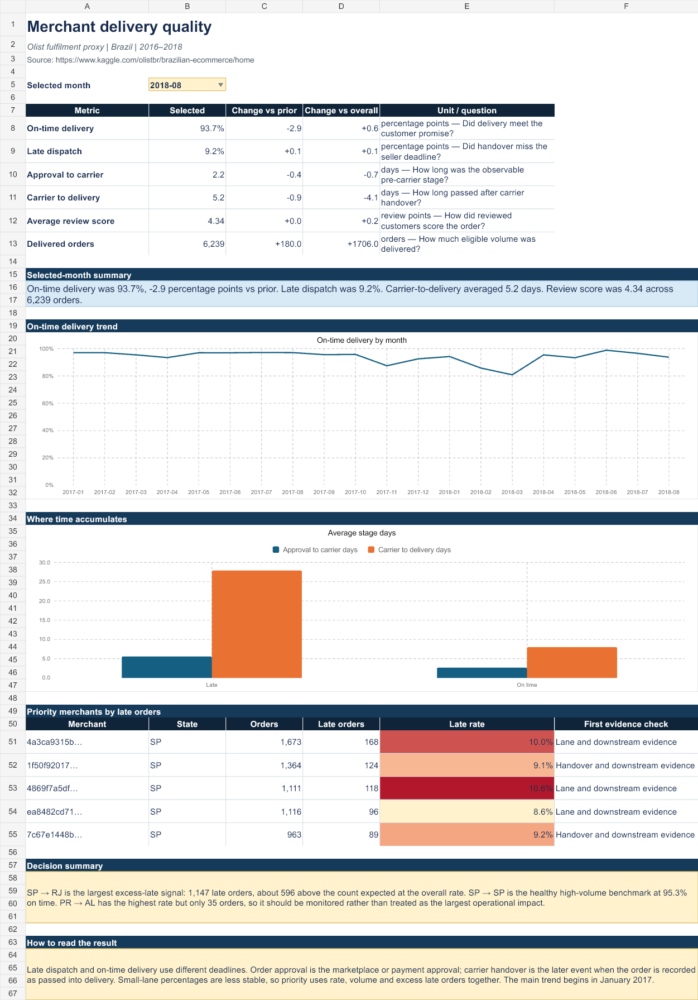
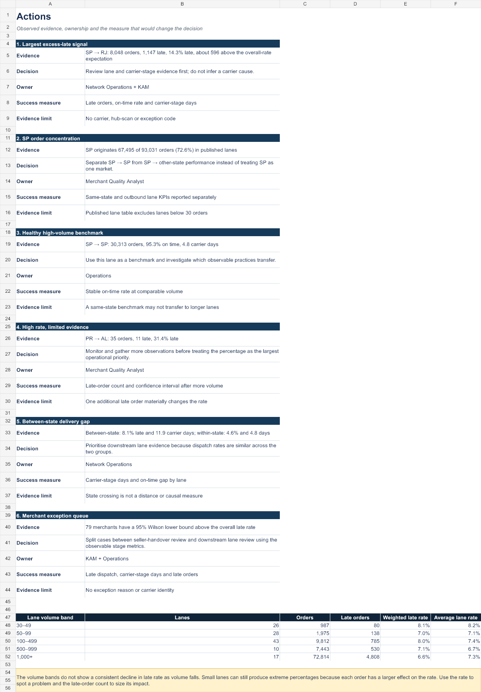

# Merchant Delivery Quality — Olist

An evidence-led merchant-quality analysis built from Olist's real, anonymised Brazilian e-commerce data. The project asks:

> Which merchants show persistent delivery-quality risk, which observable stage contributes to it, and where should an operations team investigate?

## Executive answer

- 95,195 eligible single-seller delivered orders achieved 93.15% on-time delivery.
- 79 of 615 volume-qualified merchants have a statistically elevated late-delivery rate. They represent 17.6% of eligible orders but 30.7% of late orders.
- Late orders average 5.58 days from approval to carrier and 27.90 days from carrier handover to delivery, versus 2.66 and 8.00 days for on-time orders.
- Between-state orders are late 8.14% of the time versus 4.56% within-state, while late-dispatch rates are similar. This prioritises lane and downstream handover review, but does not prove a carrier-network cause.
- The analyst challenged the rate-only lane ranking. SP → RJ has the largest excess-late signal: 1,147 late orders, about 596 above the count expected at the overall rate. PR → AL has the highest rate but only 35 orders, so it is a monitoring case rather than the largest operational impact.
- SP originates 72.6% of orders in the published 30-order-plus lane table. SP → SP is a healthy high-volume benchmark at 95.3% on time, while several SP outbound lanes perform materially worse. SP therefore needs lane-level segmentation, not one market-level conclusion.

Read the decision narrative in [CASE_STUDY.md](CASE_STUDY.md). Use [Olist_Merchant_Quality_Google_Sheets.xlsx](Olist_Merchant_Quality_Google_Sheets.xlsx) for a browser-friendly review, or [Olist_Merchant_Quality_Review.xlsx](Olist_Merchant_Quality_Review.xlsx) for the desktop Excel layout.

### Open in Google Sheets

1. In Google Sheets, choose **File → Import → Upload**.
2. Upload `Olist_Merchant_Quality_Google_Sheets.xlsx`.
3. Select **Create new spreadsheet**.

The browser version uses a narrow, vertical layout, freezes only the small header area, and keeps the charts stacked so the whole review works with normal downward scrolling.





## Why this is not another generic Olist dashboard

- Uses seller–order as the analytical grain and never calls it a parcel.
- Flags multi-seller orders instead of assigning shared delivery outcomes blindly.
- Compares promised and actual **calendar dates**, avoiding the midnight timestamp error.
- Separates approval-to-carrier time from carrier-to-customer time.
- Requires at least 30 eligible deliveries for comparative merchant reporting.
- Uses 95% Wilson intervals before flagging a merchant as elevated.
- Keeps valid delivery outcomes even when an intermediate timestamp sequence is non-monotonic; only the affected stage-duration metric is suppressed.
- Reports associations and investigation priorities, not invented root causes.
- Creates no synthetic events, markets, merchant tiers or exception reasons.

## Reproduce

```bash
python -m venv .venv
# Activate the environment, then:
pip install -r requirements.txt
python src/build_analysis.py --data-dir data/raw --output-dir artifacts
```

Place the official CSVs in `data/raw/` first; see [data/README.md](data/README.md).

## Outputs

- `seller_order_fact.csv`: auditable seller–order analytical table
- `seller_scorecard.csv`: volume-controlled merchant comparison with confidence intervals
- `regional_route_scorecard.csv`: seller-state to customer-state delivery proxy
- `lane_volume_summary.csv`: volume-band test showing why small-lane rates need caution
- `analyst_action_plan.csv`: findings translated into decisions, owners, measures and evidence limits
- `monthly_kpis.csv`: transparent monthly operational KPIs
- `delivery_outcome_comparison.csv`: stage timing and reviews for on-time versus late deliveries
- `lane_type_comparison.csv`: within-state versus between-state comparison
- `overall_kpis.csv`: source-backed comparison values for the Excel review
- `data_quality_summary.csv`: exclusions and structural issues
- `figures/`: two decision-relevant charts
- `summary.json`: compact reproducibility record

The 45 MB seller–order fact is generated locally and intentionally excluded from Git. All published scorecards remain reproducible from the official source files.

## Role-skill evidence

- **SQL:** joins, analytical grain, conditional aggregation and quality controls in `sql/merchant_quality_analysis.sql`.
- **Python:** deterministic data preparation, KPI calculation, confidence intervals and reproducible outputs in `src/build_analysis.py`.
- **Excel:** selectable reporting period, KPI tiles, editable charts, exception lists and definitions in `Olist_Merchant_Quality_Review.xlsx`.
- **Google Sheets:** browser-sized overview, an analyst action tab, impact-ranked lanes, compact frozen headers and vertically stacked charts in `Olist_Merchant_Quality_Google_Sheets.xlsx`.
- **AI:** used for workflow acceleration and QA, with numerical claims kept deterministic and auditable; see [AI_USE.md](AI_USE.md).

## Important limitation

Olist has orders and item-level sellers but no physical parcel ID, carrier identity, hub scans, locker events, attempt counts or exception reasons. The analysis can locate whether elapsed time accumulated before or after carrier handover, but it cannot observe the deeper carrier-network cause.

## Source

Brazilian E-Commerce Public Dataset by Olist: https://www.kaggle.com/olistbr/brazilian-ecommerce/home

Source data licence: CC BY-NC-SA 4.0.
